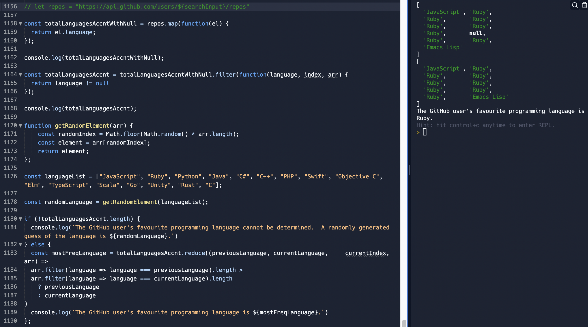

# GitHub Favourite Language Search

**GitHub Favourite Language Search is a web application designed for a user to be able to enter a random GitHub username and that GitHub user's most frequently used (favourite) programming language is displayed.**

## User Stories - MVP

Show User Stories

~~~~~~
As a user
In order to see a random GitHub user's favourite programming language
I would like to enter a random username and have that user's most frequently used programming language displayed
~~~~~~

## User Stories - Edge Cases

Show User Stories where Edge Cases are covered

~~~~~~
As a user
In the event where the GitHub user's most frequently used or all programming languages are "null"
I would like the output of the search to not incorporate the "null" labelled language data at all
~~~~~~

## User Stories - Edge Cases - Next stage of the project

Show User Stories where Edge Cases will be covered in the next stage of the project

~~~~~~
As a user
In the event where there is no output result of the search (All languages are labelled as null or no repositories in GitHub account)
I would like the search result to be a randomly selected programming language
~~~~~~

## Code Logic

Please see below the logic for the planning of the code script for all the above user story scenarios, leading up to and including this next stage of the project.:

## Features to be added in the next stage of the project.:

- More separation of concerns.  Cleaning the code. 
- A seperate file to handle the styling of the page based on the className.  An App.css file. 
- More styling to be added to the page (HTML, CSS).
- A pop up to appear if nothing entered into SearchBar stating that the field must be filled.  Done by the "required" attribute being added to the SearchBar HTML.
- A list of different GitHub usernames to appear matching the beginning characters of the username being typed as the user types the name.

# Tech Stack - Instructions

# Create React App

This project was bootstrapped with [Create React App](https://github.com/facebook/create-react-app).

## Available Scripts

In the project directory, please run:

### `npm start`

Runs the app in the development mode.\
Open [http://localhost:3000](http://localhost:3000) to view it in your browser.

The page will reload when you make changes.\
You may also see any lint errors in the console.

### `npm test`

Launches the test runner in the interactive watch mode.\
See the section about [running tests](https://facebook.github.io/create-react-app/docs/running-tests) for more information.

### `npm run build`

Builds the app for production to the `build` folder.\
It correctly bundles React in production mode and optimizes the build for the best performance.

The build is minified and the filenames include the hashes.\
Your app is ready to be deployed!

See the section about [deployment](https://facebook.github.io/create-react-app/docs/deployment) for more information.

### `npm run eject`

**Note: this is a one-way operation. Once you `eject`, you can't go back!**

If you aren't satisfied with the build tool and configuration choices, you can `eject` at any time. This command will remove the single build dependency from your project.

Instead, it will copy all the configuration files and the transitive dependencies (webpack, Babel, ESLint, etc) right into your project so you have full control over them. All of the commands except `eject` will still work, but they will point to the copied scripts so you can tweak them. At this point you're on your own.

You don't have to ever use `eject`. The curated feature set is suitable for small and middle deployments, and you shouldn't feel obligated to use this feature. However we understand that this tool wouldn't be useful if you couldn't customize it when you are ready for it.

## Learn More

You can learn more in the [Create React App documentation](https://facebook.github.io/create-react-app/docs/getting-started).

To learn React, check out the [React documentation](https://reactjs.org/).

### Code Splitting

This section has moved here: [https://facebook.github.io/create-react-app/docs/code-splitting](https://facebook.github.io/create-react-app/docs/code-splitting)

### Analyzing the Bundle Size

This section has moved here: [https://facebook.github.io/create-react-app/docs/analyzing-the-bundle-size](https://facebook.github.io/create-react-app/docs/analyzing-the-bundle-size)

### Making a Progressive Web App

This section has moved here: [https://facebook.github.io/create-react-app/docs/making-a-progressive-web-app](https://facebook.github.io/create-react-app/docs/making-a-progressive-web-app)

### Advanced Configuration

This section has moved here: [https://facebook.github.io/create-react-app/docs/advanced-configuration](https://facebook.github.io/create-react-app/docs/advanced-configuration)

### Deployment

This section has moved here: [https://facebook.github.io/create-react-app/docs/deployment](https://facebook.github.io/create-react-app/docs/deployment)

### `npm run build` fails to minify

This section has moved here: [https://facebook.github.io/create-react-app/docs/troubleshooting#npm-run-build-fails-to-minify](https://facebook.github.io/create-react-app/docs/troubleshooting#npm-run-build-fails-to-minify)

# Axios

Please install Axios with the following command.:

### `npm install axios`